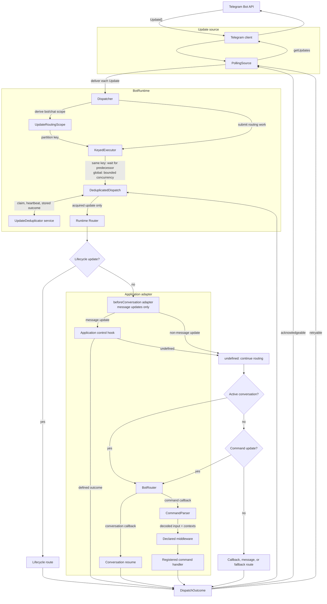

# effectloot-bot

Effect-based TypeScript workspace for portable Telegram bot infrastructure and Carneloot.

## Workspace boundaries

- `packages/tfx`: portable core. It may depend on Effect, but not Node, Bun, or PostgreSQL implementations.
- `packages/postgres`: `@tfx/postgres` adapters. It depends on `tfx` and peers on Effect SQL.
- `apps/carneloot-bot`: private Bun application consuming both public packages.

Runtime integrations use Effect platform Layers directly. `tfx` does not wrap Node or Bun platform packages. Tests remain private workspace files and are not package exports.

## TFX incoming command flow



- **`BotRuntime`** wires an `UpdateSource` to one `Dispatcher` and runs
  `source.run(dispatcher.dispatch)` in its managed scope.
- **`PollingSource`** is one `UpdateSource` implementation. It obtains batches
  with `getUpdates`, delivers updates concurrently, and advances Telegram's
  offset only through contiguous acknowledgeable `DispatchOutcome`s.
- **`Dispatcher`** is per-update coordination: derive routing scope, choose
  partition, serialize through executor, deduplicate, route, and log outcome.
- **`KeyedExecutor`** supplies bounded admission plus global concurrency while
  preserving order for one partition. Default partitioning is per bot/chat, so
  different chats may run concurrently but same-chat updates cannot overtake.
- **`DeduplicatedDispatch`** wraps routing in `UpdateDeduplicator` claim logic.
  Completed update returns stored outcome; in-progress update waits; acquired
  update receives lease heartbeats, then records its acknowledgeable outcome.
  Storage implementation is supplied by application, not owned by TFX.
- **`Router`** is generic precedence policy: lifecycle → application
  `beforeConversation` hook → active conversation → command → callback →
  message → fallback.
- **`BotRouter`** builds `Router` callbacks from bot declarations, handler
  registry, middleware, and optional conversation services. Its optional
  `beforeConversation` hook runs for message updates before conversation
  routing. Carneloot implements `/cancelar` there; matching input calls
  `CancelConversation.cancelCurrent`, while non-matching input continues to
  conversation routing. TFX neither recognizes nor owns that command. For
  command route, it matches Telegram command entity/mention, parses input, provides
  update and message contexts, runs middleware, then invokes registered
  handler.

## Toolchain

mise pins Node 24.18.0, Bun 1.3.14, and pnpm 10.17.1. pnpm is the sole package manager; Bun is an application runtime and validation runtime. TypeScript project references provide the build graph, so no Turbo layer is needed.

```sh
export MISE_ENV=development
mise install
mise exec -- pnpm install --frozen-lockfile
mise exec -- pnpm build
mise exec -- pnpm check
mise exec -- pnpm test:unit
mise exec -- pnpm test:integration
```

Run Carneloot locally after configuring PostgreSQL 17 and Telegram:

```sh
cp apps/carneloot-bot/.env.example apps/carneloot-bot/.env
# export values from the file, then:
mise exec -- pnpm --filter carneloot-bot demo
```

See the [Carneloot application guide](apps/carneloot-bot/README.md) for exact environment keys, commands, migrations, test database gates, delivery semantics, and deterministic fake-Telegram demo.

Slice 1 release validation uses `pnpm pack` dry runs only. Changesets version and publish public packages in later release work; the private application is excluded.

## Telegram API generation provenance

`tfx` generation uses Photon Telegram OpenAPI at `.repos/telegram-api/specs/telegram-bot-api.openapi.json`, pinned as submodule commit `80e0bd5d3d3155985c1a4281aec729b73e294055`. Telegram API usage remains subject to Telegram review and terms. Photon repository has no root license file while its generated package metadata says MIT. Maintainer approval and licensing resolution are required before publishing derived generated output to npm; this gate does not block local implementation or demos.
